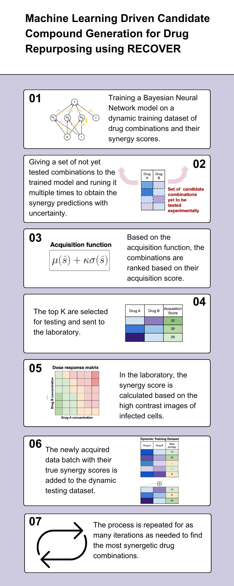

# Machine Learning Driven Candidate Compound Generation for Drug Repurposing
Based on RECOVER: sequential model optimization platform for combination drug repurposing identifies novel synergistic compounds *in vitro*

This repository is an implementation of RECOVER, a platform that can guide wet lab experiments to quickly discover synergistic drug combinations,
([preprint](https://arxiv.org/abs/2202.04202)), howerver instead of using an ensemble model to get Synergy predictions with uncertainty, we used multiple realization of a Bayesian Neural Network model. 
Since the weights are drawn from a distribution, they differ for every run of a trained model and hence give different results. The goal was to get a more precise uncertainty and achieve i quicker since the model doesn't have to be trained multiple times. 

  

## Weighted Uncertainty in Bayesian Neural Networks
Incorporating weighted uncertainty into Bayesian Neural Networks (BNNs) enhances their predictive capabilities, allowing for a more nuanced understanding of model confidence. Inspired by Bayes-by-Backprop, this implementation introduces weighted uncertainty within a Bayesian framework. Implemetation is inspired by [bayes-by-backprop](https://github.com/nitarshan/bayes-by-backprop/tree/master)

### Implementation Details
1. **Layers Module:**  
   Implemented a versatile layers module within the `models/predictors.py` file, providing flexibility by incorporating both weighted uncertainty with and without dropout. Dropout method is inspired by [variational-dropout-sparsifies-dnn](https://github.com/bayesgroup/variational-dropout-sparsifies-dnn)

2. **Bayesian Neural Network:**  
   Extended the predictive capabilities by incorporating a Bayesian Neural Network into the `models/predictors.py` file. This empowers the model to leverage uncertainty information for more informed predictions.

3. **KL Loss Method:**  
   Implemented the Kullback-Leibler (KL) loss method, as suggested by the article, within the `models/predictors.py` file. This addition is crucial for training the Bayesian model effectively, ensuring convergence to a meaningful weight distribution.

4. **Configuration Files:**  
   Introduced configuration files tailored for the Bayesian basic trainer and active trainer in the `config` directory. These files capture the necessary settings for training Bayesian models, providing a clear and organized structure for experimentation.

5. **Codebase Modifications:**  
   Ensured seamless integration by making necessary adjustments in the `train.py` and `models/model.py` files. These modifications align the training process with the new Bayesian approach, allowing for the proper utilization of weighted uncertainty.

The implemented changes collectively enhance the expressiveness and reliability of the Bayesian Neural Network, paving the way for improved model interpretability and performance. By enabling weighted uncertainty, the model gains the ability to assign varying degrees of importance to different data points during training, ultimately leading to more robust and accurate predictions.

# Laplace Priors in Bayesian Neural Networks

In Bayesian Neural Networks (BNNs), the choice of prior distributions over network parameters significantly impacts generalization and predictive performance. While **Gaussian priors** are commonly used, recent research suggests that **heavy-tailed priors**, such as the **Laplace distribution**, can offer key advantages [[1]](#references).

## Key Benefits of Laplace Priors

### 1. Robustness to Outliers  
Unlike Gaussian priors, which assume a light-tailed distribution, **Laplace priors** have heavier tails. This allows them to assign **higher probability mass** to extreme values, improving robustness to **outliers** and **uncertain inputs** [[2]](#references).

### 2. Better Uncertainty Estimation  
The heavier tails of the Laplace distribution enable the model to assign **higher uncertainty to out-of-distribution samples**, helping detect **anomalous inputs** and reducing overconfidence in uncertain predictions.

### 3. Inducing Sparsity  
Laplace priors encourage **sparsity** in the learned parameters due to their sharp peak at zero. This results in many parameters being pushed toward **zero**, effectively performing **automatic feature selection** and reducing model complexity—especially useful in high-dimensional datasets [[1]](#references).

### 4. Contrast with Gaussian Priors  
- **Laplace priors** produce more extreme coefficients (long-tail effect), making them well-suited for sparse learning.  
- **Gaussian priors** tend to generate more moderate-sized coefficients that are not exactly zero but remain small.

## Laplace Prior Definition

The Laplace distribution is mathematically defined as:

$$
p(x; \mu, b) = \frac{1}{2b} \exp\left(-\frac{|x - \mu|}{b}\right)
$$

where $$\mu$$ represents the location parameter (mean) and $$b$$ denotes the scale parameter (standard deviation).

For details on the implementation of Laplace priors in the Bayesian framework, please look at Laolace prior and Laplace BNN functions in the **[implementation](https://github.com/MinaBadri/Recover/blob/5e87e5d26753e224d91521f37005b939fb3cdbbc/recover/models/predictors.py#L405)**

## References

1. **M. Vladimirova, J. Verbeek, P. Mesejo, and J. Arbel**, “Understanding priors in Bayesian neural networks at the unit level,” *Proceedings of the 36th International Conference on Machine Learning*, vol. 97, PMLR, Sep. 2019, pp. 6458–6467.  
2. **V. Fortuin, A. Garriga-Alonso, F. Wenzel, G. Rätsch, R. E. Turner, M. van der Wilk, and L. Aitchison**, “Bayesian neural network priors revisited,” *ArXiv*, vol. abs/2102.06571, 2021.

# Sparse Variational Dropout

Dropout was originally introduced as a **regularization technique** for neural networks to improve generalization by randomly setting activations to zero during training [[1]](#references). However, this method does not explicitly reduce the number of parameters. 

In **Variational Dropout**, instead of using binary masks, the model assumes that weights follow a **probability distribution** with learnable parameters. This allows for more flexible uncertainty estimation. However, early implementations struggled with numerical stability, particularly when the dropout rate approached 1 [[2]](#references).

## Sparse Variational Dropout: A Bayesian Perspective

To address these limitations, **Sparse Variational Dropout (SVD)** was introduced [[3]](#references). This approach enhances sparsity by linking the variance of each weight to its mean:

$$
q(w|\Theta') = \prod_{ij} q(w_{ij}|\mu_{ij}, \alpha_{ij} \mu_{ij}^2)
$$

where $$\( \alpha_{ij} \)$$ controls the dropout behavior for each weight.

### Key Advantages

1. **Promotes Sparsity**  
   - Weights tend to zero for large **\( \alpha_{ij} \)** values, reducing model complexity.  
   - This leads to **fewer effective parameters**, which improves generalization.  

2. **Stable Dropout Rate**  
   - Unlike previous Variational Dropout methods, SVD avoids instability when dropout rates are high.  

3. **Computational Efficiency**  
   - A **sparser model** reduces computational costs, leading to **faster training** and **lower memory usage**.  

4. **Improved Feature Learning**  
   - Encourages the network to **focus on important features** rather than overfitting to noise.  

### Mathematical Justification

For a single Gaussian prior **\( P(w) \)**, the KL-divergence term in variational inference is:

$$
KL[q(w|\Theta') || P(w)] = \frac{1}{2} \sum_{i,j} \log (1 + \alpha_{ij})
$$

During training, minimizing this KL-term naturally promotes large **\( \alpha_{ij} \)** values, effectively shrinking unimportant weights to zero:

$$
\lim_{\alpha_{ij} \to \infty} q(w_{ij} \mid \mu_{ij}, \alpha_{ij} \mu_{ij}^2) \to \delta(w_{ij})
$$

where $$\( \delta(w_{ij}) \)$$ is the Dirac delta function, meaning **weights are deterministically zero**.

Sparse Variational Dropout provides an elegant way to **automatically prune neural networks** while maintaining stability. It effectively **switches off unnecessary weights**, leading to **lighter models** that generalize well.

For further technical details, see **[Variational Dropout Sparsifies Deep Neural Networks](https://arxiv.org/abs/1701.05369) [[3]](#references)** and our **[implementation](https://github.com/MinaBadri/Recover/blob/5e87e5d26753e224d91521f37005b939fb3cdbbc/recover/models/predictors.py#L346)**.

## References

1. **G. Hinton, N. Srivastava, A. Krizhevsky, I. Sutskever, and R. R. Salakhutdinov**, “Improving neural networks by preventing co-adaptation of feature detectors,” *ArXiv*, vol. abs/1207.0580, 2012.  
2. **D. P. Kingma, T. Salimans, and M. Welling**, “Variational dropout and the local reparameterization trick,” *Advances in Neural Information Processing Systems (NeurIPS)*, 2015.  
3. **M. Molchanov, A. Ashukha, and D. Vetrov**, “Variational Dropout Sparsifies Deep Neural Networks,” *Proceedings of the 34th International Conference on Machine Learning*, PMLR, 2017.

## Environment setup

**Requirements and Installation**: 
For all the requirements and installation steps check th orginal RECOVER repository (https://github.com/RECOVERcoalition/Recover.git). 

## Running the pipeline

Configuration files for our experiments are provided in the following directory: `Recover/recover/config`

To run the pipeline with a custom configuration:
- Create your configuration file and move it to `Recover/recover/config/`
- Run `python train.py --config <my_configuration_file>`

For example, to run the pipeline with configuration from 
the file `model_evaluation.py`, run `python train.py --config model_evaluation`.

Log files will automatically be created to save the results of the experiments.
